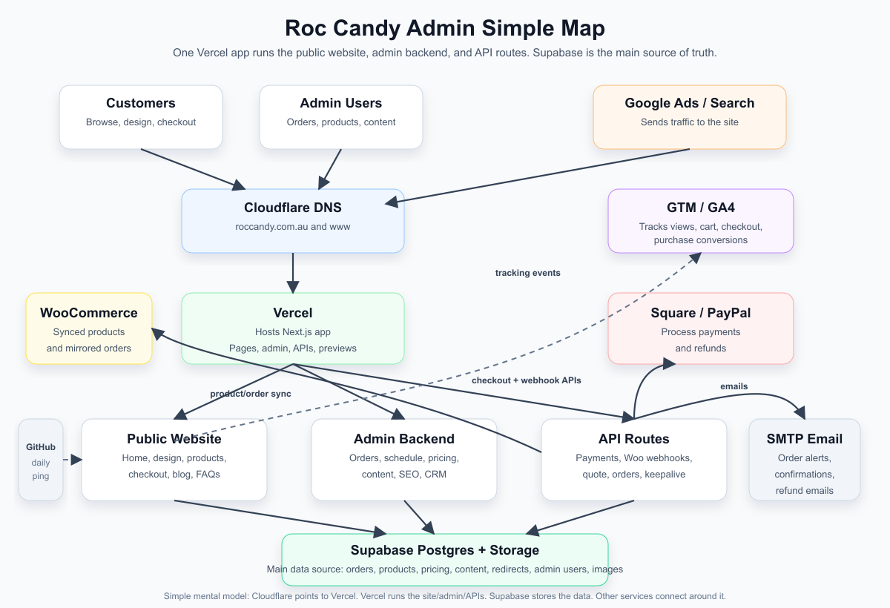

# Roc Candy Admin Simple Map

This is the short version of how the Roc Candy website, admin area, database, hosting, payments, WooCommerce, and tracking fit together.

## One-Line Summary

The public website and the admin backend are the same Next.js app on Vercel. Cloudflare points traffic to it, Supabase stores the site/admin data, WooCommerce mirrors products and orders, Square/PayPal process payments, and Google tools track traffic and conversions.

## Simple System Map



Open the image directly: [admin-simple-map.png](/Users/joeconlin/dev/roccandy/docs/admin-simple-map.png).

The editable SVG source is here: [admin-simple-map.svg](/Users/joeconlin/dev/roccandy/docs/admin-simple-map.svg).

## What Each Piece Does

| Piece | Simple role |
| --- | --- |
| Cloudflare | Controls DNS for `roccandy.com.au` and sends web traffic to Vercel. |
| Vercel | Runs the Next.js website, admin pages, checkout APIs, Woo webhooks, sitemap, and preview deployments. |
| Next.js public site | What customers see: home page, design flow, pre-made candy, checkout, blog, FAQs, terms, privacy. |
| Next.js admin | What Roc Candy staff use: orders, production schedule, products, content, SEO, redirects, users, CRM. |
| Supabase Postgres | Main database for almost everything the website/admin needs. |
| Supabase Storage | Stores uploaded product, packaging, SEO, and email preview images. |
| NextAuth | Handles admin login sessions using the `admin_users` table in Supabase. |
| WooCommerce / WordPress | Receives mirrored orders and synced pre-made products. Also supports Woo-hosted payment URLs. |
| Square | Handles card payments and Square refunds. |
| PayPal | Handles PayPal checkout and PayPal refunds. |
| SMTP email | Sends order confirmations, admin order alerts, and refund emails. |
| Google Ads | Sends paid traffic to the public site. |
| GTM / GA4 | Tracks page views and ecommerce events such as add to cart, checkout, and purchase. |
| Search Console / Merchant Center | Uses sitemap/product URLs for search visibility and product listings. |
| GitHub Actions | Pings `/api/keepalive` once a day to keep Supabase active. |

## How Admin Changes Reach The Website

```text
Admin user logs in
        |
        v
/admin pages on Vercel
        |
        v
Writes to Supabase
        |
        v
Public website reads the new data
        |
        v
Customers see updated pages, products, prices, FAQs, redirects, etc.
```

Examples:

- Change a pre-made product in admin -> Supabase updates -> product page updates -> Woo product sync runs.
- Change a landing page or SEO field -> Supabase updates -> public page metadata/content updates.
- Add a redirect -> Supabase updates -> middleware redirects old URLs.
- Change pricing/packaging -> Supabase updates -> quote builder and checkout pricing use the new rules.

## Checkout Flow

```text
Customer builds cart
        |
        v
Checkout page on Vercel
        |
        +--> Square payment
        |
        +--> PayPal payment
        |
        +--> optional Woo payment URL flow
        |
        v
Payment succeeds
        |
        v
Next.js API finalizes the order
        |
        +--> creates/updates Woo order
        +--> inserts order rows in Supabase
        +--> sends customer/admin emails
        +--> sends purchase event to GTM/GA4 in the browser
```

Supabase is the operational schedule/admin source. WooCommerce is the order/product mirror and fallback payment surface.

## WooCommerce Flow

```text
Admin manages pre-made product
        |
        v
Supabase product row
        |
        v
Next.js syncs product to WooCommerce

Customer places paid order
        |
        v
Next.js creates Woo order
        |
        v
Woo order id is saved back on Supabase order rows

Woo payment status changes
        |
        v
Woo webhook calls /api/woo/webhook
        |
        v
Supabase order status is updated
```

## Tracking And Google Flow

```text
Google Ads / organic search / direct traffic
        |
        v
Public website
        |
        v
GTM or GA4 receives events
        |
        +--> page views
        +--> add_to_cart
        +--> begin_checkout
        +--> purchase
```

Search Console and Merchant Center do not run the website. They inspect the public website, sitemap, and product pages.

## Important Mental Model

- The admin backend is not a separate app. It is part of the same Vercel/Next.js app as the public website.
- Supabase is the main source of truth for admin-managed data.
- Vercel runs the code.
- Cloudflare points the domain at Vercel.
- WooCommerce is connected, but it is not the main admin database.
- Google Ads brings traffic; GTM/GA4 records behavior and conversions.
- Square and PayPal process money; Supabase and Woo store the resulting order records.
