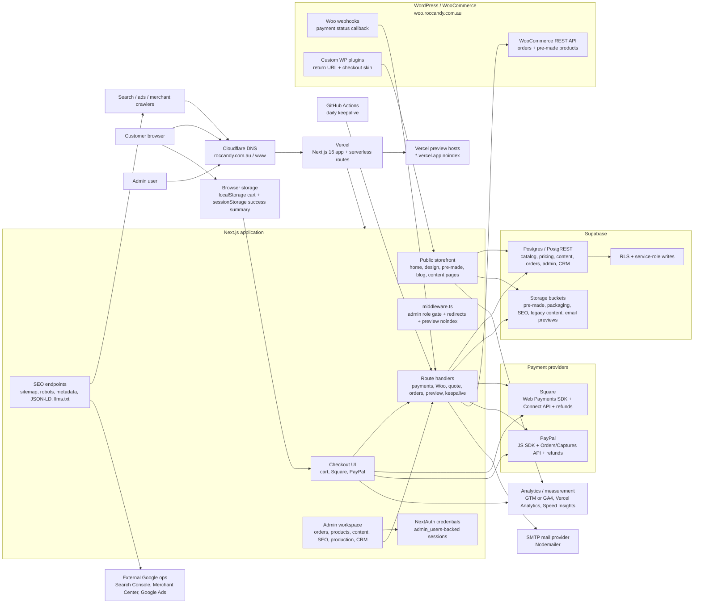
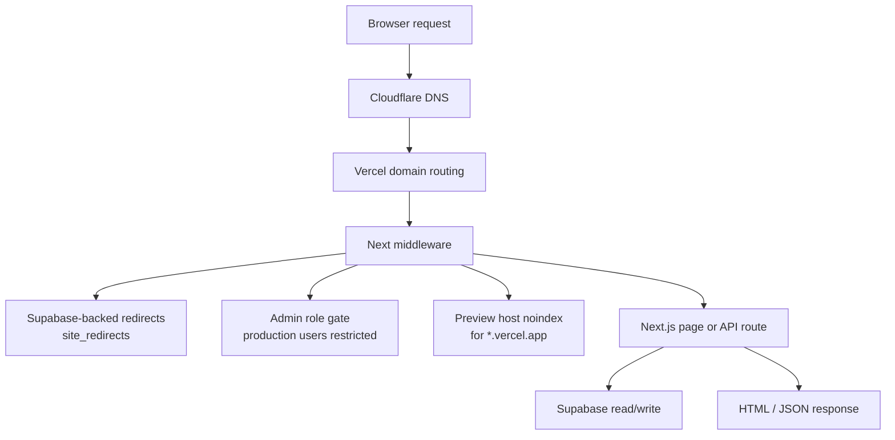
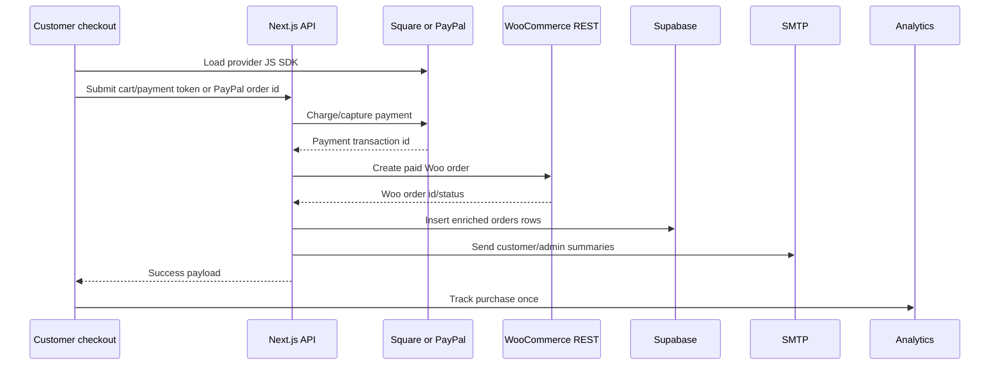
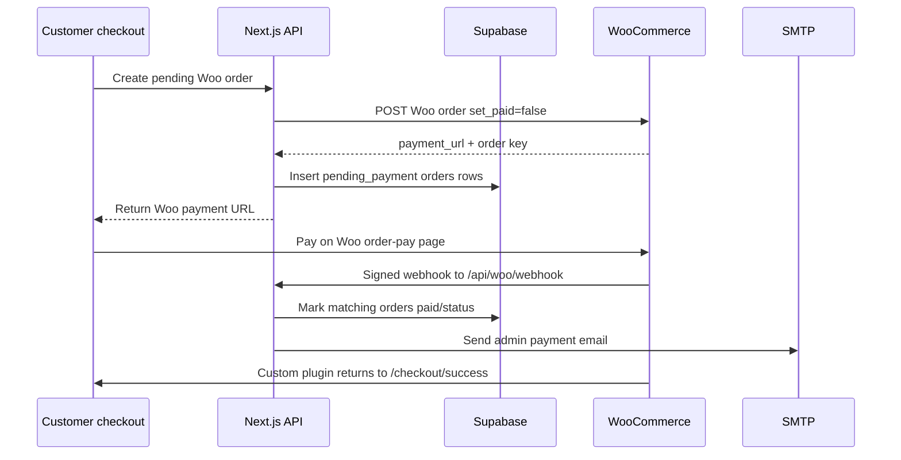
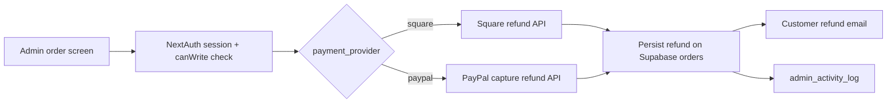
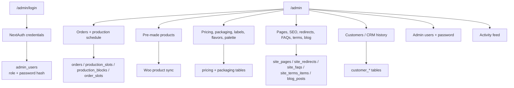
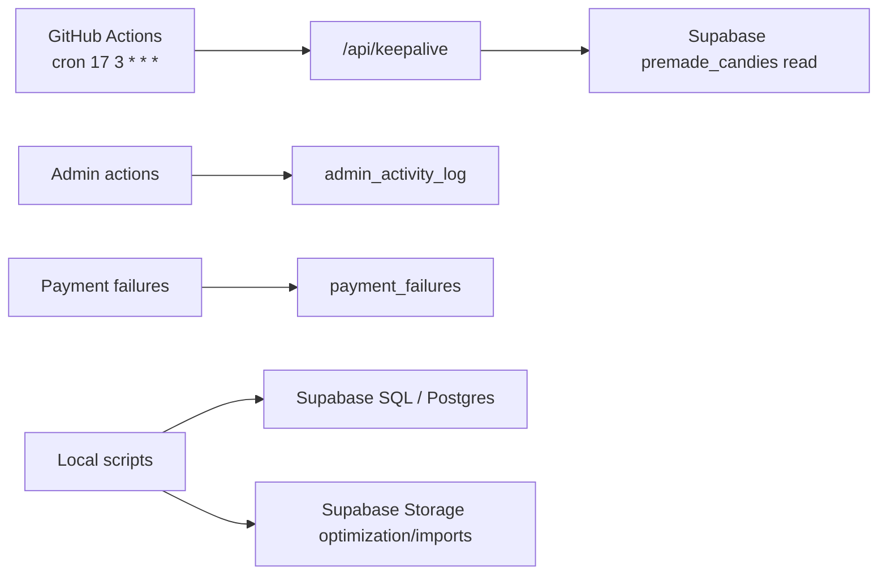

# Roc Candy Website Infrastructure Map

Last updated from the local repo on 2026-06-08.

This map is based on the checked-in docs and code. Live console state in Vercel, Cloudflare, Supabase, Square, PayPal, WooCommerce, Google, and the SMTP provider should still be verified in those services before making operational changes.

## High-Level Map

## Service Inventory

| Service | Role in the website | Evidence in repo |
| --- | --- | --- |
| Vercel | Hosts the Next.js app, route handlers, previews, image optimization, Web Analytics, and Speed Insights. | `.vercel/project.json`, `src/app/layout.tsx`, `next.config.ts` |
| Cloudflare | DNS cutover for `roccandy.com.au` and `www.roccandy.com.au`; Woo subdomain stays separate. | `docs/launch-steps.md` |
| Supabase Postgres | Main operational database for products, pricing, content, redirects, orders, admin users, production schedule, payment failures, and CRM history. | `src/lib/data.ts`, `docs/supabase_schema.sql`, `docs/sql/` |
| Supabase Storage | Public/admin image and content object storage. | `src/app/admin/premade/actions.ts`, `src/app/admin/packaging/actions.ts`, `src/lib/seoAssets.ts`, `src/lib/faqs.ts`, `src/lib/orderEmailSummary.ts` |
| NextAuth | Admin credentials auth using JWT sessions and `admin_users` table. | `src/lib/auth.ts`, `src/lib/adminUsers.ts`, `middleware.ts` |
| WooCommerce / WordPress | Woo order mirror, Woo-hosted order-pay flow, pre-made product sync, webhooks back to Next.js. | `src/lib/woo.ts`, `src/app/api/woo/*`, `wordpress/` |
| Square | Native card payment, Square Connect API charge/refund, optional Apple Pay domain verification file. | `src/app/checkout/CheckoutClient.tsx`, `src/app/api/payments/square/route.ts`, `src/lib/refunds.ts`, `public/.well-known/apple-developer-merchantid-domain-association` |
| PayPal | Native PayPal checkout through JS SDK and server-side order/capture/refund API calls. | `src/app/checkout/CheckoutClient.tsx`, `src/lib/paypal.ts`, `src/app/api/payments/paypal/*`, `src/lib/refunds.ts` |
| SMTP provider | Admin/customer order emails and refund emails via Nodemailer. | `src/lib/email.ts`, `src/lib/checkoutFinalize.ts`, `src/app/api/woo/webhook/route.ts` |
| GitHub Actions | Daily keepalive ping to the Next.js API, which reads Supabase. | `.github/workflows/supabase-keepalive.yml`, `src/app/api/keepalive/route.ts` |
| Google Tag Manager / GA4 | Client ecommerce events: `add_to_cart`, `begin_checkout`, `view_item`, `purchase`. Direct GA4 loads only when GTM is not configured. | `src/app/layout.tsx`, `src/components/Analytics.tsx`, `src/lib/analyticsEvents.ts` |
| Vercel Analytics / Speed Insights | Vercel-provided usage and performance instrumentation. | `src/app/layout.tsx`, `package.json` |
| Search Console / Merchant Center / Google Ads | Launch/SEO/commercial operations around sitemap, product URLs, ads, and conversions. | `docs/launch-steps.md`, `src/app/sitemap.ts`, `src/app/robots.ts` |
| Bing / Yandex verification | Optional metadata verification tags through env vars. | `src/lib/seo.ts` |

## Request And Hosting Flow

Important behavior:

- `roccandy.com.au` is the canonical live domain in the local launch docs.
- `www.roccandy.com.au` is intended to redirect to the apex domain.
- `*.vercel.app` preview hosts get `X-Robots-Tag: noindex, nofollow, noarchive` unless preview crawl mode is enabled.
- Public redirect rules are stored in `site_redirects` and loaded by middleware with a short cache.
- `/admin` requests are session-gated through NextAuth; production-role admins are restricted to production-focused paths.

Client-side state:

- The cart is stored in browser `localStorage` under `roccandy-cart-v1`.
- The checkout success screen is stored in browser `sessionStorage` under `roccandy-checkout-success-v1`.
- Purchase analytics de-duplication is also session-based, under `roccandy-tracked-purchases`.

## Checkout And Order Flows

### Native Square / PayPal Checkout

Implementation details:

- Square route: `/api/payments/square`
- PayPal routes: `/api/payments/paypal/create-order` and `/api/payments/paypal/capture-order`
- Shared finalizer: `src/lib/checkoutFinalize.ts`
- The finalizer creates a paid Woo order, inserts Supabase `orders` rows, sends email summaries, and returns the base order number.
- Payment failure logging writes to `payment_failures`.
- Rate limiting is in-memory per route/IP via `src/lib/rateLimit.ts`.

### Woo-Hosted Payment URL Flow

Implementation details:

- Pending Woo route: `/api/woo/create-order`
- Paid Woo finalization route: `/api/woo/create-paid-order`
- Webhook route: `/api/woo/webhook`
- Woo webhook signatures are verified with `WOO_WEBHOOK_SECRET`.
- The WordPress return URL plugin forces completed Woo order-pay flows back to `https://roccandy.com.au/checkout/success`.
- The checkout-skin plugin styles the Woo order-pay screen and reorders wallet buttons.

### Refund Flow

Refunds are handled by admin server actions in `src/app/admin/orders/actions.ts` and an API route at `/api/payments/refund`.

## Supabase Data Map

Core table groups:

| Area | Tables |
| --- | --- |
| Product and pricing | `categories`, `weight_tiers`, `packaging_options`, `packaging_option_images`, `label_types`, `label_ranges`, `settings`, `color_palette`, `flavors`, `premade_candies` |
| Orders and production | `orders`, `production_slots`, `production_blocks`, `order_slots`, `payment_failures` |
| Content and SEO | `site_pages`, `site_redirects`, `site_faqs`, `site_terms_items`, `blog_posts` |
| Admin and audit | `admin_users`, `admin_activity_log` |
| CRM/customer history | `customers`, `customer_identities`, `customer_order_history`, `customer_order_items`, `customer_contact_events`, `customer_notes`, `customer_import_runs`, `customer_import_errors` |
| Legacy/transitional | `user_roles`, `quote_blocks` appear in schema/history, but active app auth is now `NextAuth` + `admin_users`; quote blockouts are currently derived from `production_blocks`. |

Supabase access pattern:

- `supabaseAdminClient` uses `SUPABASE_SERVICE_ROLE_KEY` and is required for privileged server writes.
- `supabasePublicClient` uses `NEXT_PUBLIC_SUPABASE_ANON_KEY` for public-readable content where RLS allows it.
- Normal browser code should not receive the service role key.
- SQL migrations and audits live under `docs/sql/`.

## Supabase Storage Map

| Bucket / location | Purpose | Code path |
| --- | --- | --- |
| `premade-images` | Pre-made product images, public URLs used on product pages and Woo sync. | `src/app/admin/premade/actions.ts`, `src/lib/premadeCatalog.ts` |
| `packaging-images` | Packaging option photos, keyed to packaging/category/lid color. | `src/app/admin/packaging/actions.ts`, `scripts/import-packaging-images.mjs` |
| `seo-images` | Uploaded Open Graph/share images for pages and pre-made SEO. Bucket is created on demand if missing. | `src/lib/seoAssets.ts` |
| `site-content` | Legacy FAQ JSON fallback at `faqs.json`. | `src/lib/faqs.ts` |
| `flavor-images` or `EMAIL_PREVIEW_BUCKET` | Generated email preview images for candy designs. | `src/lib/orderEmailSummary.ts` |
| `public/` in repo | Static bundled assets served by Next/Vercel: branding, favicons, landing media, payment logos, flavour images, Apple Pay verification file. | `public/`, `next.config.ts` |

## Admin Workspace Map

Role behavior:

- `admin`: can write and manage users.
- `editor`: can write content/ops but cannot manage users.
- `seo`: can write SEO/content areas intended for SEO.
- `production`: restricted by middleware to production paths and print views.
- `viewer`: read-oriented fallback role.
- Bootstrap env login is only used when no database-backed admin users exist.

## Public Surface

Main public routes:

- `/`
- `/design`
- `/design/wedding-candy`
- `/design/custom-text-candy`
- `/design/branded-logo-candy`
- `/quote`
- `/checkout`
- `/checkout/success`
- `/pre-made-candy`
- `/pre-made-candy/[item]`
- `/about`
- `/faqs` and `/faq`
- `/blog` and `/blog/[slug]`
- `/contact` through catch-all managed pages
- `/privacy`
- `/terms-and-conditions`

SEO/system routes:

- `/sitemap.xml`
- `/robots.txt`
- `/manifest.webmanifest`
- `/llms.txt`
- preview image endpoints under `/api/preview/*`

## API Route Map

| Route | Purpose |
| --- | --- |
| `/api/auth/[...nextauth]` | NextAuth auth/session endpoints. |
| `/api/quote` | Calculate custom order pricing from Supabase pricing/config tables. |
| `/api/payments/square` | Square charge then shared paid-order finalization. |
| `/api/payments/paypal/create-order` | Create PayPal order for the cart total. |
| `/api/payments/paypal/capture-order` | Capture PayPal order then shared paid-order finalization. |
| `/api/payments/refund` | Authenticated refund endpoint for Square/PayPal payments. |
| `/api/payments/log-failure` | Client/server payment failure logging into `payment_failures`. |
| `/api/woo/create-order` | Create pending Woo order and insert pending Supabase order rows. |
| `/api/woo/create-paid-order` | Shared finalizer for a paid Woo-style payload. |
| `/api/woo/webhook` | Signed Woo callback that updates Supabase order payment state. |
| `/api/preview/candy` | SVG candy preview endpoint. |
| `/api/preview/candy-image` | Edge-generated image preview endpoint. |
| `/api/keepalive` | Supabase read used by GitHub Actions keepalive. |

## Environment Variable Map

Public/browser-visible variables:

- `NEXT_PUBLIC_SITE_URL`
- `NEXT_PUBLIC_SUPABASE_URL`
- `NEXT_PUBLIC_SUPABASE_ANON_KEY`
- `NEXT_PUBLIC_SQUARE_APP_ID`
- `NEXT_PUBLIC_SQUARE_LOCATION_ID`
- `NEXT_PUBLIC_SQUARE_ENV`
- `NEXT_PUBLIC_PAYPAL_CLIENT_ID`
- `NEXT_PUBLIC_PAYPAL_ENV`
- `NEXT_PUBLIC_GTM_ID`
- `NEXT_PUBLIC_GA_MEASUREMENT_ID`
- `NEXT_PUBLIC_PREVIEW_SITE_URL`
- `NEXT_PUBLIC_VERCEL_URL`

Server-only/runtime variables:

- `SUPABASE_SERVICE_ROLE_KEY`
- `NEXTAUTH_SECRET`
- `NEXTAUTH_URL`
- `ADMIN_BOOTSTRAP_EMAIL`, `ADMIN_BOOTSTRAP_EMAILS`, `ADMIN_EMAIL`, `ADMIN_EMAILS`
- `ADMIN_BOOTSTRAP_PASSWORD`, `ADMIN_PASSWORD`
- `WOO_BASE_URL`, `WOO_CONSUMER_KEY`, `WOO_CONSUMER_SECRET`, `WOO_AUTH_METHOD`, `WOO_CUSTOM_PRODUCT_ID`, `WOO_WEBHOOK_SECRET`
- `SQUARE_ACCESS_TOKEN`, `SQUARE_LOCATION_ID`, `SQUARE_API_BASE`
- `PAYPAL_CLIENT_ID`, `PAYPAL_SECRET`, `PAYPAL_ENV`, `PAYPAL_API_BASE`
- `SMTP_HOST`, `SMTP_PORT`, `SMTP_USER`, `SMTP_PASS`, `SMTP_FROM`, `SMTP_SECURE`, `SMTP_ENABLED`
- `ORDERS_EMAIL`, `ENQUIRIES_EMAIL`
- `GOOGLE_SITE_VERIFICATION`, `BING_SITE_VERIFICATION`, `YANDEX_SITE_VERIFICATION`
- `ALLOW_PREVIEW_CRAWL`, `PREVIEW_SITE_URL`, `SITE_URL`, `VERCEL_URL`
- `EMAIL_PREVIEW_BUCKET`

Script/database variables:

- `SUPABASE_POOLER_CONNECTION`
- `DATABASE_URL`
- `POSTGRES_URL`
- `SUPABASE_DB_PASSWORD` is present locally but current scripts prefer a connection URL.

## Automation And Operations

Operational scripts:

- `npm run db:apply-sql` runs SQL files against Supabase/Postgres.
- `npm run sync-managed-content` restores built-in managed content rows for fresh/partial Supabase environments.
- `npm run import-packaging-images` uploads packaging images and writes `packaging_option_images`.
- `npm run import-customer-history` imports legacy/current customer history into CRM tables.
- `npm run optimize-uploaded-images` optimizes objects in storage buckets and updates references.
- `npm run normalize-jar-sizes` normalizes packaging option names.

## External Launch/Console Items Not Proven By Code

These are called out in `docs/launch-steps.md` as unchecked or operationally pending in the local docs:

- GitHub `KEEPALIVE_URL` secret update to `https://roccandy.com.au/api/keepalive`.
- Live-domain admin login/logout smoke test.
- Live-domain payment smoke test and confirmation that Woo, Supabase, admin email, and customer email all receive the order.
- GA4 purchase tracking and conversion/key-event setup.
- Google Ads final URL cleanup if any still point at `vercel.app`.
- Merchant Center website/product URL switch and diagnostics.
- Search Console URL inspection for key pages.
- Apple Pay verification against the live domain if Apple Pay is enabled/re-enabled.

## Source Pointers

- Main launch/runbook: `docs/launch-steps.md`
- Existing architecture notes: `docs/architecture-notes.md`
- Supabase schema: `docs/supabase_schema.sql`, `docs/orders-schema.sql`, `docs/sql/`
- Supabase clients: `src/lib/supabase/admin.ts`, `src/lib/supabase/public.ts`
- Auth: `src/lib/auth.ts`, `src/lib/adminUsers.ts`, `middleware.ts`
- Checkout finalization: `src/lib/checkoutFinalize.ts`, `src/lib/checkoutOrder.ts`
- Payments: `src/app/api/payments/*`, `src/lib/paypal.ts`, `src/lib/refunds.ts`
- Woo integration: `src/lib/woo.ts`, `src/app/api/woo/*`, `wordpress/`
- Email: `src/lib/email.ts`, `src/lib/orderEmailSummary.ts`
- Analytics: `src/app/layout.tsx`, `src/components/Analytics.tsx`, `src/lib/analyticsEvents.ts`
- SEO/system endpoints: `src/app/sitemap.ts`, `src/app/robots.ts`, `src/app/manifest.ts`, `src/app/llms.txt/route.ts`
- Keepalive: `.github/workflows/supabase-keepalive.yml`, `src/app/api/keepalive/route.ts`
